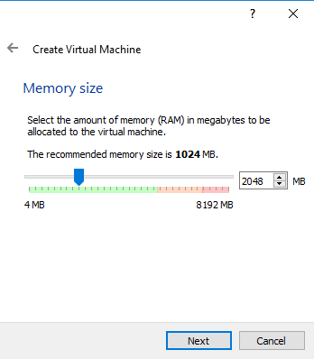
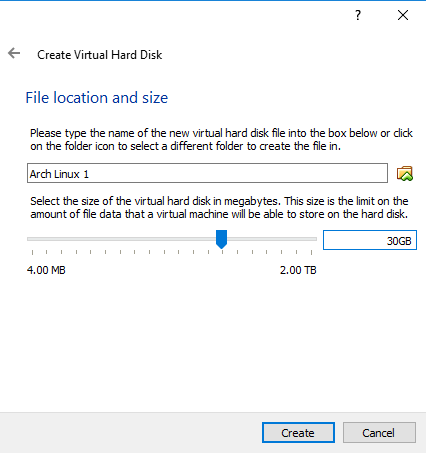
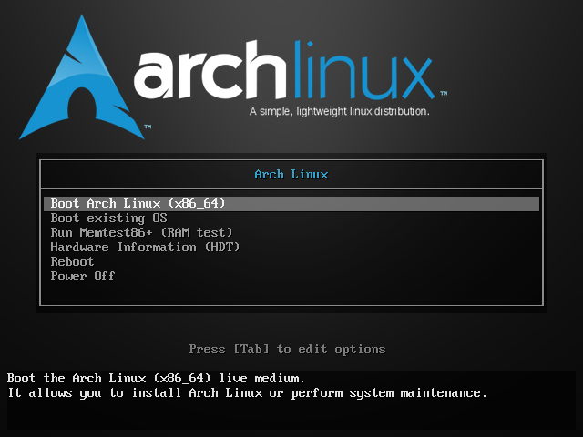
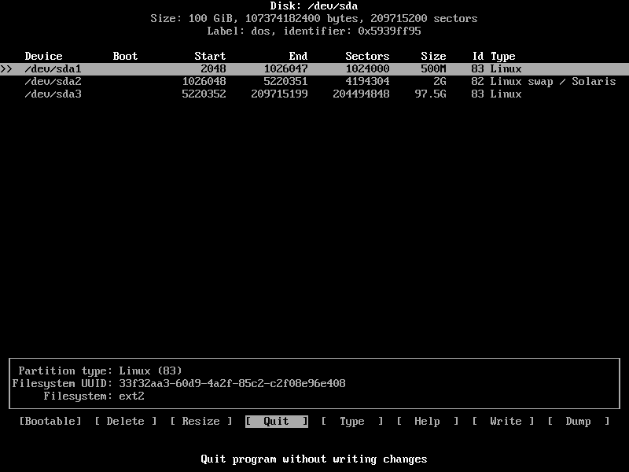
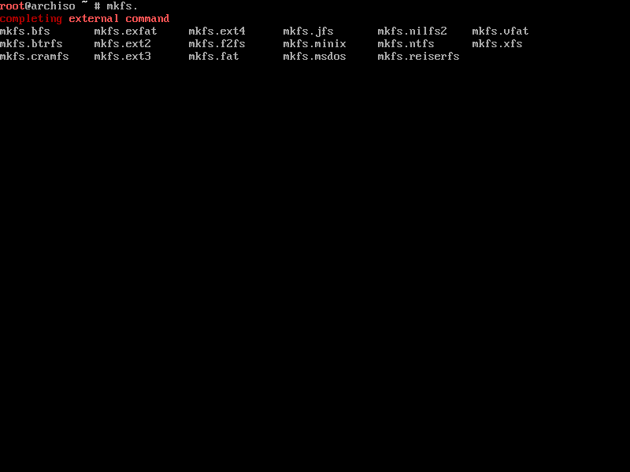

[Home](index.md)

## Welcome to my guide on installing the best Linux distro FOSS can buy. Lets get started!
* [Arch Linux Download](https://www.archlinux.org/download/)
* [Virtualbox Download](https://www.virtualbox.org/wiki/Downloads)
---
1. First things first, we need an install environment. For this, Virtualbox will suffice.


2. Now, install Virtualbox and Create your VM.


3. I recommend having allocating memory between 2-4GB



4. Create your HD image. Choose your favourite format. Default settings will suffice and choose how much space you want to allocate. I recommend a minimum of 30GB for VM's.



5. Now after the VM is created, tweak it to your liking, I recommend having 2-4 CPU cores allocated, and attach your Arch Linux ISO file to your VM. This is where the fun starts.

6. Boot up the VM and boot Arch Linux from the selection.



7. Wait a little and you'll be greeted with a command shell. Now follow these steps carefully. The first thing we need to do is partition the HD. I recommend using the `cfdisk` utility. If you only have one HD attached, simply run `cfdisk` on its own. Extra hard drives can be partitioned by running `cfdisk /dev/sdX`with the "X" being the drive letter. Eg `cfdisk /dev/sdb`.



This is a typical partition setup, it is best to have a separate boot partition from the root. With applying partitions, select **New** and type in the size you want, the recommended size is 500M for the first boot partition. So just type in `500M` and press enter and set it as primary. The next partition is for swap, swap is basically temp storage for when memory runs out. Kind of like a pagefile in Windows. I recommend having around `2G` for the second partition and apply it. Then select **Type** then select **82 Linux Swap/Solaris**. The final partition is the root partition. Just press **New** and fill in the rest of the drive by just pressing Enter right through. Then simply hit the **Write** selection to write this partition table. Then quit out. Also, take note of your partition numbers so we can format them accordingly.

8. Now we come to formatting the partitions on the drive. The simplest and most reliable being EXT4. You can view all formats by typing `mkfs.` then hitting the TAB key. It will list all available `mkfs` commands.



Now run these commands in order, I'll be using my `/dev/sda` so yours might be different depending on your setup, so double check if you have multiple drives on an actual machine.

```
mkfs.ext4 /dev/sda1

mkswap /dev/sda2

mkfs.ext4 /dev/sda3
```
